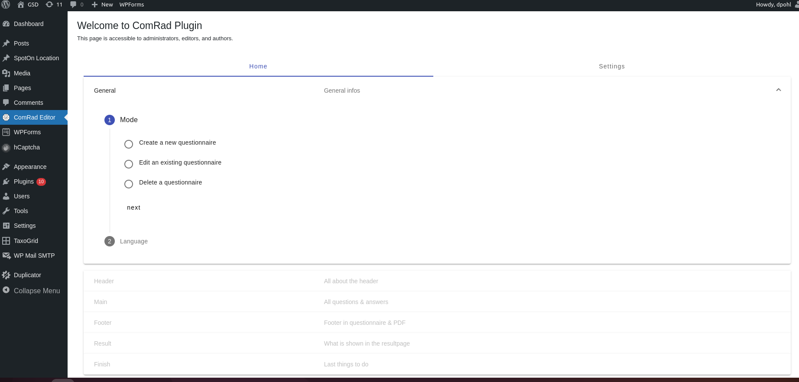

# Comrad Questionnaire Editor

<p align="center">
  
</p>

<p align="center">
  <strong>The powerful Angular-based editor for the Comrad Questionnaire System, providing a rich and intuitive interface for building complex surveys within WordPress.</strong>
</p>

<p align="center">
  
  
  
  
</p>

This repository contains the editor frontend for **Comrad**, a cutting-edge WordPress plugin for creating interactive questionnaires. This application is a sophisticated **Single Page Application (SPA)** built with Angular, designed to be seamlessly embedded within the WordPress admin area. It provides administrators, editors, and authors with a modern, block-based interface to build multi-page questionnaires.

## Screenshots

1. **Comrad Editor - Overview**<br />
Overview of the editor interface in the WordPress backend.
<p align="center" width="100%">
    
</p>
   

2. **Comrad Editor - Question Builder**<br />
Example of how to build a questionnaire with sliders, checkboxes, and radio buttons.
<p align="center" width="100%">
    
</p>

## ✨ Architectural Highlights & Key Features

This application is engineered with a robust and scalable architecture, leveraging the power of the Angular ecosystem to deliver a feature-rich editing experience.

-   **Modern Angular Framework (v18):**
    Built on the latest version of Angular, the editor benefits from a strong, component-based architecture, lazy loading, and a powerful dependency injection system. This results in a highly modular, maintainable, and performant application, even as complexity grows.

-   **Professional UI with Angular Material:**
    The entire user interface is constructed using **Angular Material**, providing a consistent, accessible, and visually appealing experience that feels native to the WordPress environment. It includes a comprehensive suite of UI components like drag-and-drop lists, steppers, and advanced form controls.

-   **Rich Text Editing with TinyMCE:**
    For creating detailed question text and descriptions, the editor integrates **TinyMCE**, a market-leading WYSIWYG editor. This gives content creators the power and flexibility of a full-featured text editor directly within the questionnaire builder.

-   **Dynamic and Reactive Form Building:**
    Leveraging Angular's powerful **Reactive Forms**, the editor allows for the dynamic construction of complex, multi-page questionnaires. State management and validation are handled efficiently, providing a smooth and error-free user experience.

-   **Internationalization (i18n) Ready:**
    With **ngx-translate**, the editor is built from the ground up to support multiple languages, allowing it to be used in a global context.

-   **Seamless WordPress Integration:**
    The application is specifically designed to be built and embedded into a WordPress plugin, with scripts to automate the process of creating a production build and copying the files to the correct plugin directory.

## 🚀 Getting Started

To set up the project locally for development, you will need Node.js (version >=20.16.0).

1.  **Clone the repository:**
    ```
    git clone https://github.com/dpohl-web/comrad-editor_public.git
    cd comrad-editor_public
    ```

2.  **Install dependencies:**
    ```
    npm install
    ```

3.  **Run the development server:**
    This command starts the Angular development server and uses a proxy configuration (`proxy.conf.json`) to forward API requests to a local WordPress instance, enabling seamless development.
    ```
    npm start
    ```
    The application will be available at `http://localhost:4200`.

## 🛠️ Key Scripts

The `package.json` includes several scripts to streamline the development and build process:

| Command                   | Description                                                                 |
| ------------------------- | --------------------------------------------------------------------------- |
| `npm start`               | Starts the local development server with proxying.                          |
| `npm run build`             | Creates a standard production build of the application.                     |
| `npm run buildforwp`        | Builds the app for WordPress integration (without output hashing).          |
| `npm run buildforwpandcopy` | The complete workflow: builds for WordPress and copies the files into the plugin. |
| `npm run test`              | Runs the unit tests using Karma and Jasmine.                                |
| `npm run lint`              | Lints the codebase to ensure code quality and consistency.                  |
| `npm run test:playwright` | Runs end-to-end tests using Playwright.                                   |

## ⚙️ Tech Stack & Key Dependencies

This project leverages a powerful set of modern tools and libraries to deliver a high-quality application:

-   **[Angular](https://angular.io/) (v18.2):** A platform for building mobile and desktop web applications.
-   **[Angular Material](https://material.angular.io/):** Material Design components for Angular.
-   **[RxJS](https://rxjs.dev/):** A library for reactive programming using Observables, making it easier to compose asynchronous or callback-based code.
-   **[TinyMCE](https://www.tiny.cloud/):** A rich-text editor for creating and managing content.
-   **[ngx-translate](https://github.com/ngx-translate/core):** An internationalization (i18n) library for Angular.
-   **[Playwright](https://playwright.dev/):** A framework for reliable end-to-end testing for modern web apps.
-   **[TypeScript](https://www.typescriptlang.org/):** A typed superset of JavaScript that compiles to plain JavaScript.

## License

This project is intended for use with the Comrad WordPress plugin and is subject to its licensing terms.

